# Manual de Usuario — goSorensen ProAnalytics

**Aplicación web interactiva para el análisis de similitud funcional entre listas de genes mediante el método goSorensen**

*Escuela Superior Politécnica de Chimborazo (ESPOCH)*

---

**Franklin Stalin Paucar Chicaiza**1\* &nbsp;&nbsp; &amp; &nbsp;&nbsp; **Pablo Javier Flores Muñoz**2\*\*

1 Escuela Superior Politécnica de Chimborazo (ESPOCH), Facultad de Ciencias

\* [franklins.paucar@espoch.edu.ec](mailto:franklins.paucar@espoch.edu.ec)
\*\* [p_flores@espoch.edu.ec](mailto:p_flores@espoch.edu.ec)

*15 de mayo de 2026*

---

## Tabla de contenidos

- [1 Resumen](#1-resumen)
  - [1.1 Propósito de la aplicación](#11-propósito-de-la-aplicación)
  - [1.2 Panel de Control (lateral izquierdo)](#12-panel-de-control-lateral-izquierdo)
- [2 Módulo 1: Gestión de Datos](#2-módulo-1-gestión-de-datos)
- [3 Módulo 2: Tablas y Matriz GO](#3-módulo-2-tablas-y-matriz-go)
- [4 Módulo 3: Test de Equivalencia](#4-módulo-3-test-de-equivalencia)
- [5 Módulo 4: Disimilaridad (MDS)](#5-módulo-4-disimilaridad-mds)
- [6 Solución de Problemas frecuentes](#6-solución-de-problemas-frecuentes)
- [7 Referencias](#7-referencias)

---

# 1 Resumen

El presente documento constituye el **Manual de Usuario** oficial de la
aplicación web **goSorensen ProAnalytics**, concebida como una interfaz
gráfica interactiva publicada en un servidor web que opera sobre el paquete
`goSorensen` de Bioconductor, con el propósito de poner al alcance de
investigadores del área biológica **el test de equivalencia basado en el
índice de Sørensen–Dice** para evaluar la similitud funcional entre listas
de genes mediante términos de la ontología génica (Gene Ontology, GO)
**sin necesidad de instalar R ni ningún software adicional**.

Este manual se redacta con un enfoque **pedagógico y descriptivo**,
organizado por módulos funcionales que reflejan la disposición visual de la
aplicación. Cada sección integra fundamentos conceptuales mínimos,
instrucciones operativas paso a paso y recomendaciones prácticas para
asegurar la correcta interpretación de los resultados.

La base de datos de ejemplo empleada para ilustrar los resultados a lo largo
de este manual se encuentra disponible públicamente en el siguiente enlace:

<https://raw.githubusercontent.com/StalinPaucar/GOSORAPP/refs/heads/main/data%20examples/Genes_Enfermedades_Neurologicas.csv>

## 1.1 Propósito de la aplicación

La interacción directa con el paquete `goSorensen` requiere conocimiento de
estructuras de datos de Bioconductor, gestión de paquetes de anotación
(`org.Hs.eg.db`, `org.Mm.eg.db`, etc.) y manejo de la sintaxis de R. La
aplicación **goSorensen ProAnalytics** elimina esta barrera técnica al
ofrecer:

- **Carga de datos asistida** desde formatos comunes (CSV, XLSX).
- **Conversión automática** de identificadores con sistema de rescate
  multi-keytype.
- **Construcción automatizada** de tablas de contingencia y matrices de
  enriquecimiento.
- **Ejecución del test de equivalencia** con visualización integral de
  resultados.
- **Análisis exploratorio** mediante dendrogramas y escalamiento
  multidimensional (MDS).

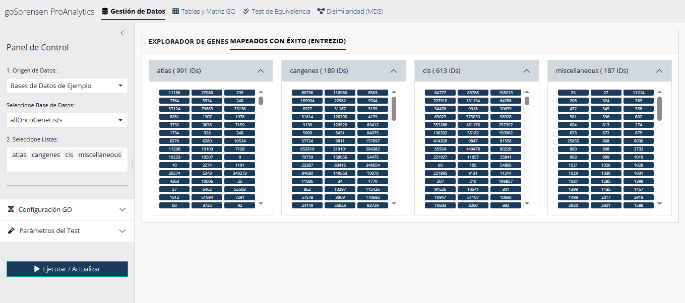

*Figura 1. Vista general de la aplicación web **goSorensen ProAnalytics**.*

## 1.2 Panel de Control (lateral izquierdo)

Al ingresar a la aplicación, el primer elemento visible es el **panel de
control lateral**, desde donde se configuran todos los parámetros del
análisis. Este panel acompaña permanentemente al usuario en todas las
pestañas de la aplicación.

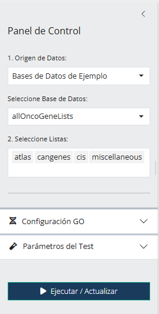

*Figura 2. Panel lateral con los controles de configuración del análisis.*

### 1.2.1 Origen de datos

En el panel lateral izquierdo, el control **"1. Origen de Datos"** ofrece
dos modalidades:

- **Bases de Datos de Ejemplo**: incluye los conjuntos `allOncoGeneLists` y
  `pbtGeneLists` distribuidos con el paquete `goSorensen`. Estos conjuntos
  de listas de genes son útiles para fines didácticos y de validación.
- **Cargar mis propios datos**: activa el asistente de importación para que
  el usuario cargue su propia base de listas de genes.

### 1.2.2 Listas de genes

El control **"2. Seleccione Listas"** muestra todas las listas disponibles
de la base actualmente seleccionada o cargada.

> [!NOTE]
> Se pueden seleccionar solo ciertas listas de interés para acelerar
> los cálculos cuando el número total de listas disponibles es elevado.

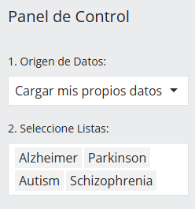

*Figura 3. Selección de la base de datos y de las listas de genes.*

### 1.2.3 Configuración previa: parámetros GO

Antes de ejecutar el análisis, el usuario debe definir en la sección
**"Configuración GO"** del panel lateral los siguientes parámetros:

| Parámetro       | Opciones / Descripción                                                                                |
|-----------------|-------------------------------------------------------------------------------------------------------|
| **Ontología**   | `BP` (Biological Process), `CC` (Cellular Component), `MF` (Molecular Function).                      |
| **Nivel GO**    | Profundidad jerárquica del DAG ontológico (3–10). Niveles más altos generan términos más específicos. |
| **Organismo**   | Paquete de anotación: humano (`org.Hs.eg.db`), ratón (`org.Mm.eg.db`) o rata (`org.Rn.eg.db`).        |

> [!NOTE]
> **Sugerencia metodológica:** el **nivel GO 4** constituye un equilibrio
> adecuado entre granularidad biológica y robustez estadística. Niveles
> superiores a 7 tienden a generar tablas con frecuencias muy bajas,
> comprometiendo la potencia del test.

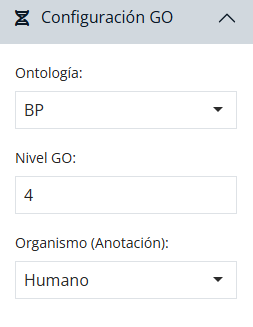

*Figura 4. Selección de la Ontología, el Nivel GO y el tipo de Organismo.*

### 1.2.4 Configuración previa: parámetros del test

En el panel lateral, los controles **"Parámetros del Test"** exponen los
parámetros que definen la sensibilidad del test de equivalencia:

| Parámetro             | Descripción                                                                              |
|-----------------------|------------------------------------------------------------------------------------------|
| **Límite $d_0$**      | Umbral de irrelevancia (numérico, valor por defecto 0.4444).                             |
| **Confianza**         | Nivel de confianza del intervalo (entre 0.80 y 0.99; defecto 0.95).                      |
| **Usar Bootstrap**    | Si se activa, el test emplea simulación bootstrap en lugar de aproximación asintótica.   |
| **N° Simulaciones**   | Número de réplicas bootstrap (por defecto 10 000; mínimo recomendado 1 000).             |

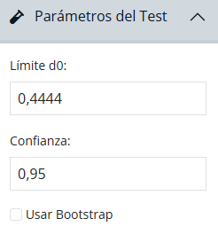

*Figura 5. Selección del umbral de irrelevancia $d_0$, el nivel de confianza y la opción de simulación bootstrap.*

> [!WARNING]
> **Recomendación:** active el modo **bootstrap** cuando las listas tengan
> tamaños pequeños o las frecuencias de la tabla de contingencia presenten
> celdas con valores reducidos. La aproximación asintótica puede ser
> inestable bajo esas condiciones.

---

# 2 Módulo 1: Gestión de Datos

El módulo de **Gestión de Datos** es el punto de entrada operativo de la
aplicación. Su objetivo es transformar las listas de genes proporcionadas
por el usuario en cualquier formato común de identificadores a una
estructura homologada y validada en `ENTREZID`, único formato aceptado por
las funciones de anotación GO.

> [!NOTE]
> **¿Qué es ENTREZID?** Es el sistema oficial de identificadores numéricos
> del NCBI (*National Center for Biotechnology Information*) para
> representar genes de forma unívoca. Es el único sistema sobre el cual operan internamente
> las funciones de enriquecimiento GO; por ello, la aplicación homologa
> automáticamente cualquier otro tipo de identificador antes del análisis.

## 2.1 Asistente de importación y conversión de IDs

Al seleccionar la opción **"Cargar mis propios datos"** del panel de
control lateral, la pestaña **"Gestión de Datos"** despliega un asistente
estructurado en **tres pasos secuenciales**.

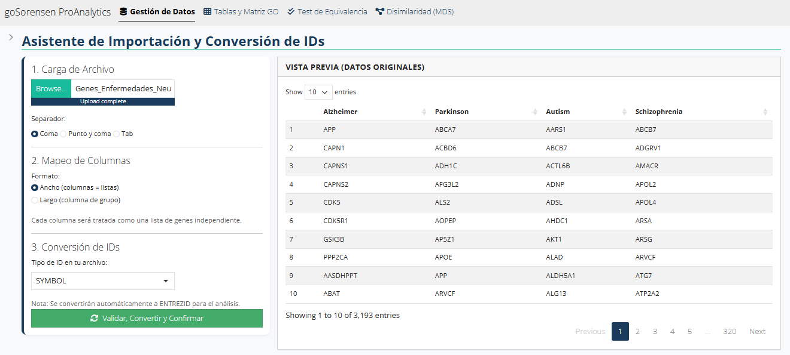

*Figura 6. Asistente de importación y conversión de identificadores.*

### 2.1.1 Paso 1: Carga del archivo

El usuario selecciona el archivo desde su sistema local. Los formatos
admitidos son:

| Extensión | Tipo de archivo                                       |
|-----------|-------------------------------------------------------|
| `.csv`    | Valores separados por comas, punto y coma o tabulador |
| `.xlsx`   | Microsoft Excel (formato moderno)                     |
| `.xls`    | Microsoft Excel (formato heredado)                    |
| `.txt`    | Texto plano delimitado                                |

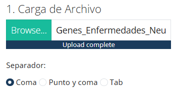

*Figura 7. Primer paso del asistente: carga del archivo de datos.*

Para archivos CSV y TXT, el control **"Separador"** permite indicar el
carácter delimitador empleado (coma, punto y coma o tabulador). La
aplicación detecta automáticamente la codificación y aplica una lectura
robusta tolerante a columnas de longitud desigual y a celdas vacías.

### 2.1.2 Paso 2: Mapeo de columnas

Una vez cargado el archivo, el panel **"Vista Previa (Datos Originales)"**
muestra el contenido tabular para inspección. El usuario debe declarar el
**formato** de los datos:

- **Formato Ancho** (`wide`): cada columna del archivo representa una lista
  de genes independiente. Los nombres de las columnas se utilizan como
  identificadores de las listas.
- **Formato Largo** (`long`): existe una única columna con los
  identificadores de gen y una segunda columna que indica el grupo o lista
  a la que pertenece cada gen. En este caso, se solicita seleccionar la
  *"Columna de Genes"* y la *"Columna de Grupos"*.

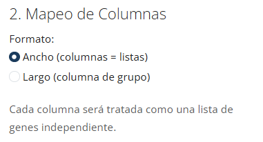

*Figura 8. Segundo paso del asistente: declaración del formato y mapeo de columnas.*

### 2.1.3 Paso 3: Conversión de identificadores

El método `goSorensen`, así como las funciones subyacentes de Bioconductor
para enriquecimiento GO, operan exclusivamente sobre identificadores
**ENTREZID** (NCBI Entrez Gene identifiers). Cualquier otro sistema de
identificación ampliamente utilizado en la literatura debe ser
**homologado** a ENTREZID antes del análisis.

El control **"Tipo de ID en tu archivo"** acepta los siguientes formatos
de entrada:

| Tipo de ID  | Descripción                                                    |
|-------------|----------------------------------------------------------------|
| `SYMBOL`    | Símbolos oficiales del gen (ej. *APP*, *MAPT*, *SNCA*)         |
| `ENTREZID`  | Identificadores numéricos de NCBI Entrez Gene                  |
| `ENSEMBL`   | Identificadores Ensembl (ej. *ENSG00000142192*)                |
| `UNIPROT`   | Identificadores de la base UniProt                             |
| `REFSEQ`    | Identificadores RefSeq (NCBI)                                  |
| `ALIAS`     | Alias o sinónimos históricos del símbolo                       |

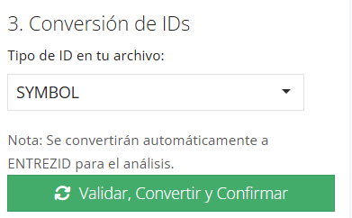

*Figura 9. Tercer paso del asistente: declaración del tipo de ID y ejecución de la conversión.*

### 2.1.4 Vista previa de datos originales

Tras cargar el archivo, el panel derecho muestra una vista previa
interactiva de la matriz de datos con paginación y desplazamiento
horizontal.

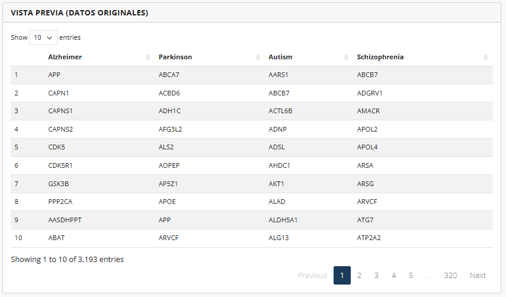

*Figura 10. Vista previa de la matriz de datos original.*

### 2.1.5 Sistema de rescate multi-keytype

Una de las contribuciones técnicas de la aplicación es su **sistema de
rescate automático** para identificadores no mapeados. La estrategia es la
siguiente:

1. **Mapeo primario**: la aplicación intenta convertir todos los
   identificadores utilizando el tipo de ID declarado por el usuario.
2. **Detección de fallos**: los identificadores que no producen
   coincidencia se acumulan en una lista de "no mapeados".
3. **Rescate iterativo**: para cada identificador fallido, la aplicación
   intenta sucesivamente el mapeo contra los restantes tipos de ID
   disponibles (`SYMBOL`, `ENSEMBL`, `ALIAS`, `UNIPROT`, `REFSEQ`),
   preservando un registro trazable del tipo que produjo el rescate.
4. **Consolidación**: el conjunto final de identificadores ENTREZID
   válidos integra mapeos directos y rescates.

Este procedimiento es útil cuando el archivo de origen contiene
identificadores **mixtos** (por ejemplo, una columna donde la mayoría son
símbolos pero algunas filas contienen alias o identificadores Ensembl).

> [!WARNING]
> **Recomendación:** el usuario siempre debe inspeccionar la pestaña
> *Trazabilidad de Rescate* (descrita más adelante) para verificar la
> naturaleza de los identificadores rescatados y descartar coincidencias
> espurias.

## 2.2 Estado de la homologación

Tras presionar el botón **"Validar, Convertir y Confirmar"**, el panel
*Estado de la Homologación* presenta una tabla resumen con las siguientes
columnas:

| Columna                | Significado                                                       |
|------------------------|-------------------------------------------------------------------|
| `Lista`                | Nombre de la lista procesada.                                     |
| `Originales`           | Número de identificadores únicos en el archivo de entrada.        |
| `Mapeados_Finales`     | Total de IDs convertidos exitosamente a ENTREZID.                 |
| `Rescatados`           | IDs recuperados mediante el sistema de rescate multi-keytype.     |
| `No_Mapeados_Finales`  | IDs que no pudieron homologarse por ningún tipo de ID.            |

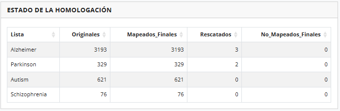

*Figura 11. Resumen del proceso de homologación de identificadores.*

## 2.3 Explorador de Genes

Una vez completada la homologación, la pestaña *Gestión de Datos* despliega
un explorador interactivo organizado en **tres sub-pestañas**.

### 2.3.1 Mapeados con Éxito (EntrezID)

Presenta, para cada lista seleccionada, una rejilla con todos los
identificadores ENTREZID resultantes. Cada gen se muestra dentro de un
acordeón colapsable que indica el tamaño total de la lista.

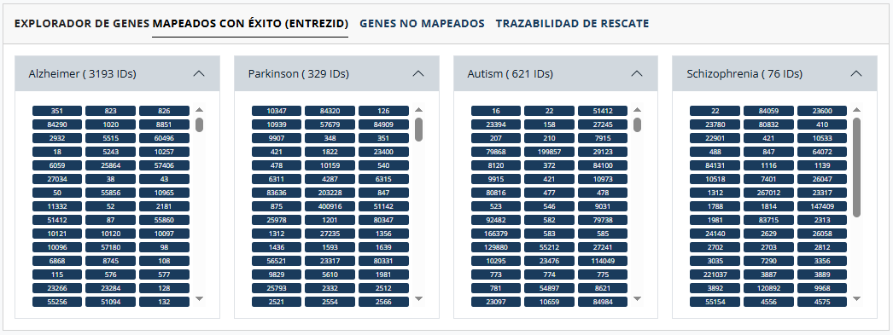

*Figura 12. Explorador de genes mapeados exitosamente a EntrezID.*

### 2.3.2 Genes No Mapeados

Lista los identificadores que no lograron ser homologados, destacados con
color rojo para resaltar la pérdida de información. El investigador debe
evaluar caso por caso si estos genes:

- Corresponden a identificadores con **errores tipográficos**.
- Pertenecen a un **organismo distinto** al seleccionado.
- Son entradas **obsoletas o retiradas** de las bases de datos.

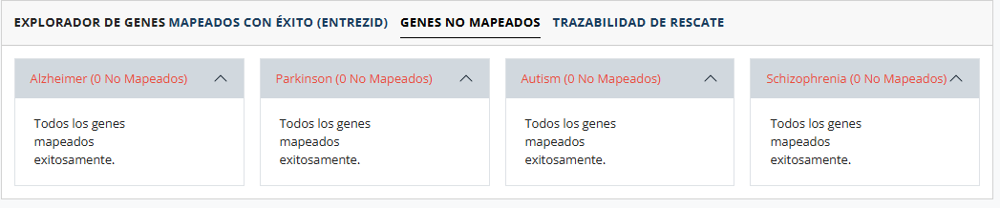

*Figura 13. Genes que no pudieron ser homologados a ENTREZID.*

### 2.3.3 Trazabilidad de Rescate

Tabla exportable (formatos *copy*, *CSV*, *Excel*) con el detalle de los
identificadores recuperados por el sistema de rescate. Para cada rescate
se documenta: lista de origen, ID original tal como apareció en el archivo,
tipo de ID que permitió el rescate y ENTREZID asignado.

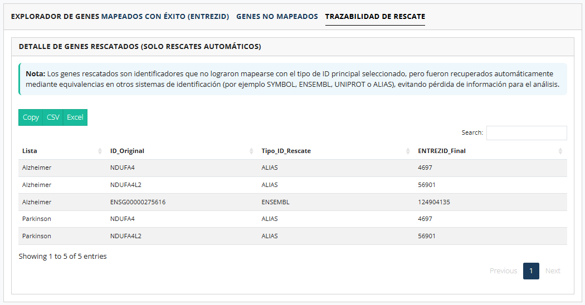

*Figura 14. Tabla exportable de trazabilidad del sistema de rescate multi-keytype.*

---

# 3 Módulo 2: Tablas y Matriz GO

Una vez confirmadas las listas de genes y configurados los parámetros de
la ontología en el panel lateral, la pulsación del botón
**"Ejecutar / Actualizar"** desencadena la construcción del enriquecimiento
GO subyacente. Los resultados de esta fase se distribuyen entre los
Módulos 2, 3 y 4.

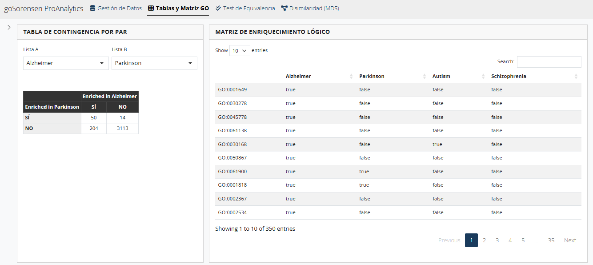

*Figura 15. Vista general del módulo Tablas y Matriz GO.*

## 3.1 Tabla de contingencia 2×2

Para cada par de listas $(A, B)$ seleccionadas, la aplicación construye una
**tabla de contingencia 2×2** que clasifica cada término GO según su estado
de enriquecimiento conjunto. Sobre estas frecuencias se calcula el
**índice de disimilaridad de Sørensen–Dice**:

$$
\hat{d} \;=\; \frac{n_{12} + n_{21}}{2\,n_{11} + n_{12} + n_{21}}
$$

donde $\hat{d} \in [0, 1]$. Valores cercanos a 0 indican alta similitud
funcional, y valores cercanos a 1 indican disimilaridad casi completa.

El usuario selecciona el par de listas a inspeccionar mediante los
controles **"Lista A"** y **"Lista B"** en la parte superior del panel.

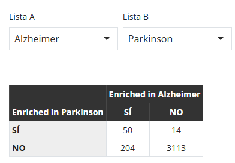

*Figura 16. Tabla de contingencia 2×2 entre dos listas seleccionadas.*

**Interpretación de la tabla:** de los términos GO evaluados, **14** están
enriquecidos simultáneamente en ambas listas (*Alzheimer* y *Parkinson*);
**31** están enriquecidos solo en *Alzheimer*; **30** solo en *Parkinson*;
y **400** términos no están enriquecidos en ninguna de las dos listas. Con
estas frecuencias, $\hat{d} = (31 + 30) / (2 \cdot 14 + 31 + 30) \approx 0.6855$.

## 3.2 Matriz de enriquecimiento lógico

El panel derecho muestra la **matriz de enriquecimiento lógico**, una
estructura de mayor dimensionalidad que reporta, para cada término GO
(filas) y cada lista de genes (columnas), un valor booleano que indica si
ese término está enriquecido en esa lista.

Esta matriz constituye la **materia prima** sobre la que se construyen
todas las tablas de contingencia de pares y, por extensión, la matriz
global de disimilaridades del Módulo 4.

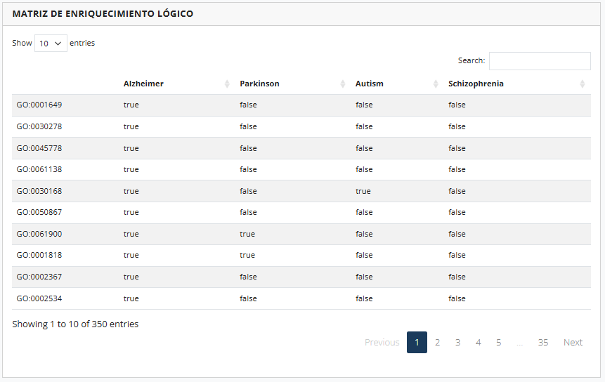

*Figura 17. Matriz de enriquecimiento lógico (términos GO × listas).*

---

# 4 Módulo 3: Test de Equivalencia

Este módulo constituye el **núcleo inferencial** de la aplicación. Aquí se
ejecuta el test de equivalencia estadística basado en la disimilitud de
Sørensen–Dice, con el propósito de determinar si dos listas de genes
presentan **equivalencia funcional** según los términos GO enriquecidos
compartidos.

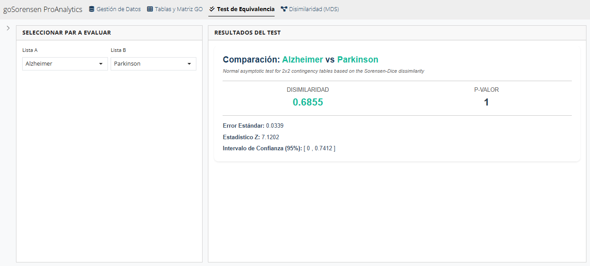

*Figura 18. Vista general del módulo Test de Equivalencia.*

## 4.1 Fundamento conceptual

El test contrasta las hipótesis:

$$
H_0 : d \geq d_0 \qquad \text{vs.} \qquad H_1 : d < d_0
$$

donde $d$ es la disimilaridad poblacional entre las dos listas y $d_0$ es
el **umbral de irrelevancia** definido por el usuario (por defecto
$d_0 = 0.4444$).

La lógica del test **invierte la convención frecuentista habitual**:
rechazar $H_0$ implica **afirmar la equivalencia funcional** entre las
listas. Por consiguiente:

| Resultado                  | Interpretación                                                                  |
|----------------------------|---------------------------------------------------------------------------------|
| $p\text{-valor} < 0.05$    | Se rechaza $H_0$. Existe **evidencia estadística de equivalencia funcional**.   |
| $p\text{-valor} \geq 0.05$ | No se rechaza $H_0$. **No hay evidencia suficiente** para afirmar equivalencia. |

## 4.2 El umbral de irrelevancia $d_0$

El parámetro $d_0$ es la **máxima disimilaridad** que el investigador
considera biológicamente despreciable. Su elección es decisiva, pues
determina la sensibilidad del test:

- Valores **bajos** de $d_0$ (ej. 0.20) implican un criterio **estricto**:
  se exige alta similitud para concluir equivalencia.
- Valores **altos** de $d_0$ (ej. 0.60) implican un criterio **flexible**:
  se admite mayor disimilaridad como tolerable.

El valor por defecto $d_0 = 0.4444$ corresponde al recomendado en la
literatura metodológica de referencia (Flores et al., 2022) para análisis
inferenciales de equivalencia funcional.

> [!NOTE]
> **Esquema visual del test de equivalencia:** sobre la línea de
> disimilaridad $[0, 1]$, observe la posición relativa del **límite superior
> del intervalo de confianza** y el **umbral** $d_0$. Si el límite superior
> del IC cae **por debajo** de $d_0$, se concluye **equivalencia funcional**
> con el nivel de confianza declarado (típicamente 95%). Si, por el
> contrario, el límite superior **supera** $d_0$, no es posible afirmar
> equivalencia.

## 4.3 Parámetros del test

En el panel lateral, la sección **"Parámetros del Test"** expone los
siguientes controles (resumidos también en la sección 1.2.4):

| Parámetro             | Descripción                                                                        |
|-----------------------|------------------------------------------------------------------------------------|
| **Límite $d_0$**      | Umbral de irrelevancia (numérico, valor por defecto 0.4444).                       |
| **Confianza**         | Nivel de confianza del intervalo (entre 0.80 y 0.99; defecto 0.95).                |
| **Usar Bootstrap**    | Si se activa, el test emplea simulación bootstrap en lugar de aproximación normal. |
| **N° Simulaciones**   | Número de réplicas bootstrap (por defecto 10 000; mínimo recomendado 1 000).       |

> [!WARNING]
> **Recomendación:** active el modo bootstrap cuando las listas tengan
> tamaños pequeños o las frecuencias de la tabla de contingencia presenten
> celdas con valores reducidos. La aproximación asintótica puede ser
> inestable bajo esas condiciones.

## 4.4 Lectura del panel de resultados

El panel de resultados despliega una **tarjeta resumen** estructurada con
los siguientes elementos:

- **Disimilaridad $\hat{d}$**: estimación puntual del índice de
  Sørensen–Dice entre las listas seleccionadas.
- **P-Valor**: nivel de evidencia estadística del test de equivalencia
  respecto al umbral $d_0$ (codificado cromáticamente en rojo si
  $p < 0.05$).
- **Error Estándar**: medida de precisión asociada a la estimación de la
  disimilaridad.
- **Estadístico Z**: valor del estadístico de prueba empleado en la
  aproximación asintótica.
- **Intervalo de Confianza**: rango estimado para la disimilaridad
  poblacional al nivel de confianza especificado por el usuario.

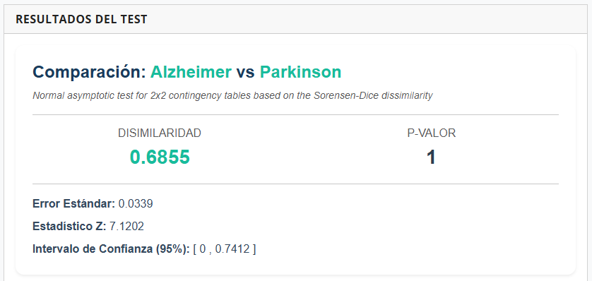

*Figura 19. Tarjeta de resultados del test de equivalencia entre dos listas.*

### 4.4.1 Regla práctica de interpretación

Para el ejemplo mostrado (*Alzheimer* vs *Parkinson*):

- **Disimilaridad estimada:** $\hat{d} = 0.6855$.
- **Intervalo de Confianza 95%:** $[0,\,0.7412]$.
- **Umbral declarado:** $d_0 = 0.4444$.

Dado que el límite superior del intervalo de confianza ($0.7412$) **es
mayor** que $d_0 = 0.4444$, se concluye que las listas *Alzheimer* y
*Parkinson* **no** son **funcionalmente equivalentes** con un nivel de
confianza del 95%. El $p$-valor de $1$ confirma este resultado al **no
rechazar $H_0$**.

---

# 5 Módulo 4: Disimilaridad (MDS)

Cuando el análisis involucra **múltiples listas de genes**, el número de
comparaciones pareadas aumenta considerablemente, dificultando la
interpretación global de las relaciones funcionales. Este módulo incorpora
herramientas de **análisis multivariante** para representar y explorar
estructuras de similitud y disimilaridad entre listas de genes.

## 5.1 Sub-pestaña 1: Matriz de Irrelevancia y Dendrograma

### 5.1.1 Matriz de disimilaridades

La matriz simétrica $D = (d_{ij})$ contiene las disimilaridades estimadas
entre todos los pares de listas. La aplicación calcula esta matriz de
forma automática mediante la función `sorenThreshold()` del paquete
`goSorensen` y la presenta con **codificación cromática** (barras de color
que reflejan la magnitud relativa de cada celda).

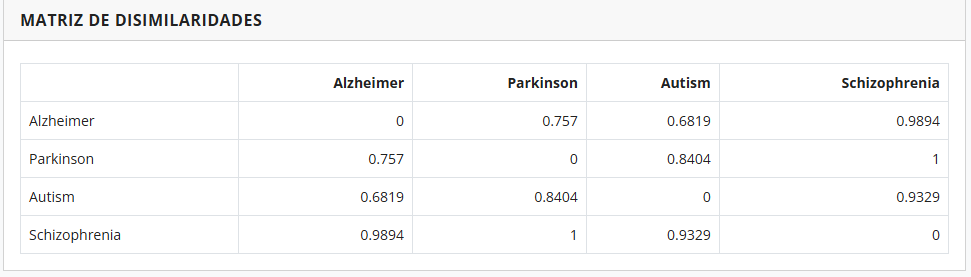

*Figura 20. Matriz de disimilaridades con codificación cromática.*

### 5.1.2 Dendrograma de agrupamiento jerárquico

A partir de la matriz $D$ se construye un **agrupamiento jerárquico**
(función `hclustThreshold()` de `goSorensen`) que organiza las listas
según su proximidad funcional. La altura de cada bifurcación representa
la disimilaridad a la que se fusionan dos clusters.

**Lectura del dendrograma:**

- Listas que se unen a **alturas bajas** comparten un perfil de
  enriquecimiento GO similar.
- Cortes horizontales del dendrograma a una altura $h^* \approx d_0$
  definen agrupaciones de listas **mutuamente equivalentes** según el
  criterio de irrelevancia adoptado.

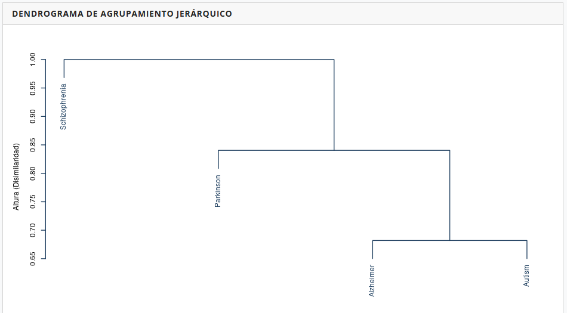

*Figura 21. Dendrograma de agrupamiento jerárquico de las listas de genes.*

## 5.2 Sub-pestaña 2: Gráfico MDS y Términos GO Discriminantes

### 5.2.1 Gráfico MDS interactivo

El **Escalamiento Multidimensional Clásico** (`cmdscale`) proyecta la
matriz de disimilaridades en un espacio bidimensional preservando, en lo
posible, las distancias originales. Cada lista de genes se representa como
un punto cuya posición refleja su perfil funcional global.

Los ejes muestran el **porcentaje de varianza explicada** por cada
dimensión, calculado a partir de los autovalores positivos de la
descomposición. El gráfico es **interactivo**: el usuario puede hacer
zoom, desplazarse y visualizar el nombre de cada lista al posicionar el
cursor sobre los puntos.

**Interpretación visual:**

- Listas **próximas** en el plano MDS comparten perfiles funcionales
  similares.
- Listas **alejadas** describen procesos biológicos divergentes.
- La disposición a lo largo de cada eje sugiere **gradientes funcionales**
  subyacentes que pueden ser explorados mediante los términos GO
  discriminantes.

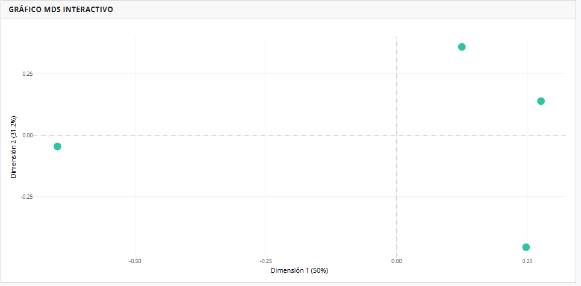

*Figura 22. Gráfico MDS interactivo con la proyección bidimensional de las listas.*

### 5.2.2 Términos GO discriminantes

Para cada dimensión del MDS, la aplicación identifica los **términos GO
que mejor explican la separación** entre los extremos del eje. El
procedimiento es el siguiente:

1. Las listas se ordenan según su coordenada en la dimensión seleccionada.
2. Se conforman dos grupos extremos (cuantil inferior 20% y superior 20%).
3. Para cada término GO, se calcula un **estadístico de tipo $t$** que
   contrasta la frecuencia media de enriquecimiento entre ambos grupos:

$$
t_k \;=\; \frac{\bigl|\,\bar{e}_{L,k} - \bar{e}_{R,k}\,\bigr|}{\sqrt{\dfrac{s_{L,k}^{\,2}}{n_L} + \dfrac{s_{R,k}^{\,2}}{n_R}}}
$$

4. Los **15 términos** con mayor estadístico se reportan junto con su
   descripción biológica recuperada de `GO.db`.

El control **"Seleccione Dimensión para Análisis"** permite alternar entre
la **Dimensión 1** y la **Dimensión 2**, ofreciendo dos lecturas
funcionales complementarias del mismo plano MDS.

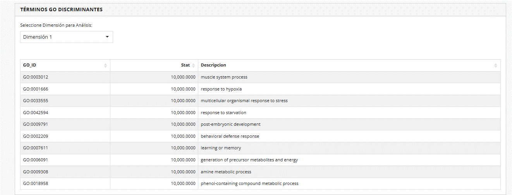

*Figura 23. Tabla de términos GO discriminantes para la dimensión seleccionada.*

> [!NOTE]
> **Nota técnica:** la **Dimensión 2** requiere al menos **3 listas** para
> ser estimada; con dos listas el análisis se restringe a la primera
> dimensión.

---

# 6 Solución de Problemas frecuentes

## 6.1 El archivo no carga o aparece vacío

| Causa probable                                  | Solución                                                                          |
|-------------------------------------------------|-----------------------------------------------------------------------------------|
| Separador incorrecto                            | Verifique el carácter delimitador real abriendo el archivo en un editor de texto. |
| Codificación distinta a UTF-8                   | Guarde el archivo como CSV UTF-8 desde Excel u otro editor.                       |
| Archivo Excel con celdas combinadas o macros    | Exporte previamente a CSV plano.                                                  |
| Conexión inestable durante la carga             | Verifique su conexión a Internet y reintente la carga.                            |

## 6.2 Tasa de mapeo muy baja (< 70 %)

Si la columna *Mapeados_Finales* presenta un porcentaje reducido respecto
a *Originales*, considere:

- **Organismo incorrecto**: confirme que el paquete de anotación
  seleccionado (humano, ratón o rata) coincide con la especie del
  estudio.
- **Tipo de ID mal declarado**: el sistema de rescate puede compensar
  esta situación; revise la pestaña *Trazabilidad de Rescate* para
  identificar el tipo predominante real.
- **IDs heterogéneos**: si el archivo combina símbolos antiguos (alias)
  con símbolos actuales, declare `SYMBOL` como tipo principal y deje que
  el rescate por `ALIAS` complete el mapeo.

## 6.3 El test devuelve un p-valor de 1 o muy cercano

Esto suele indicar:

- Tablas de contingencia con celdas vacías o casi vacías (potencia
  insuficiente).
- Listas de genes excesivamente pequeñas (< 30 IDs).
- Nivel GO demasiado profundo (reduzca el nivel a 3 o 4).

## 6.4 El dendrograma o el gráfico MDS no se actualizan

Confirme que ha presionado el botón **"Ejecutar / Actualizar"** después de
modificar **parámetros estructurales** (ontología, nivel GO, organismo o
listas seleccionadas). Cambios solo en $d_0$ o en el nivel de confianza
**no exigen** recalcular la matriz de disimilaridades.

## 6.5 La sesión expira o se desconecta

Como la aplicación se ejecuta en un servidor web, las sesiones inactivas
pueden cerrarse tras un período prolongado. Si esto ocurre:

- Recargue la página del navegador (F5 o Ctrl+R).
- Vuelva a cargar sus datos o seleccione las listas de ejemplo.
- Repita el análisis presionando **"Ejecutar / Actualizar"**.

---

# 7 Referencias

Flores, P., Salicrú, M., Sánchez-Pla, A., & Ocaña, J. (2022). An
equivalence test between feature lists, based on the Sørensen–Dice index
and the joint frequencies of GO term enrichment. *BMC Bioinformatics*,
23, 207. <https://doi.org/10.1186/s12859-022-04739-2>

Flores Muñoz, P. J. (2025). *Functional similarity between feature lists
based on the joint enrichment of the gene ontology terms* [Tesis
doctoral, Universitat Politècnica de Catalunya]. Repositorio UPC.
<https://hdl.handle.net/2117/425062>

Flores Muñoz, P. J. (2025). *Statistical inference based on the Sorensen-Dice dissimilarity and the Gene Ontology (GO)* [Documentación y vignettes del paquete R]. Bioconductor.
<https://www.bioconductor.org/packages/release/bioc/html/goSorensen.html>

---

<em>Manual de Usuario — goSorensen ProAnalytics</em> 
<em>Escuela Superior Politécnica de Chimborazo — 2026</em>

